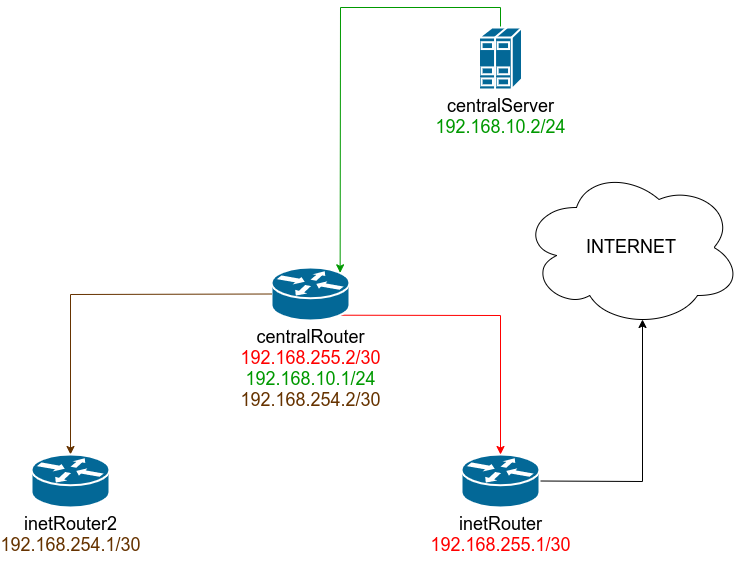

# Сценарии iptables

[Vagrantfile](Vagrantfile)
```
vagrant up
```

***Схема стенда***



---
## Knocking port

[knocking_port.yml](knocking_port.yml)
```
ansible-playbook knocking_port.yml
```

зайти по ssh c `centralServer` на `inetServer`
```
./knock.sh 192.168.255.1 8881 7777 9991
ssh 192.168.255.1
```
## Nginx на centralServer с пробросом порта на inetRouter2
установка nginx
```
ansible-playbook nginx.yml
``` 
проброс портов реализован на centralRouter
```
    iptables -t nat -A PREROUTING -i eth3 -p tcp -m tcp --dport 8080 -j DNAT --to-destination 192.168.10.2:80
    iptables -t nat -A POSTROUTING -d 192.168.10.2/24 -p tcp -m tcp --dport 80 -j SNAT --to-source 192.168.254.2
```
проверка
```
vagrant ssh inetRouter2
curl http://192.168.254.2:8080
```