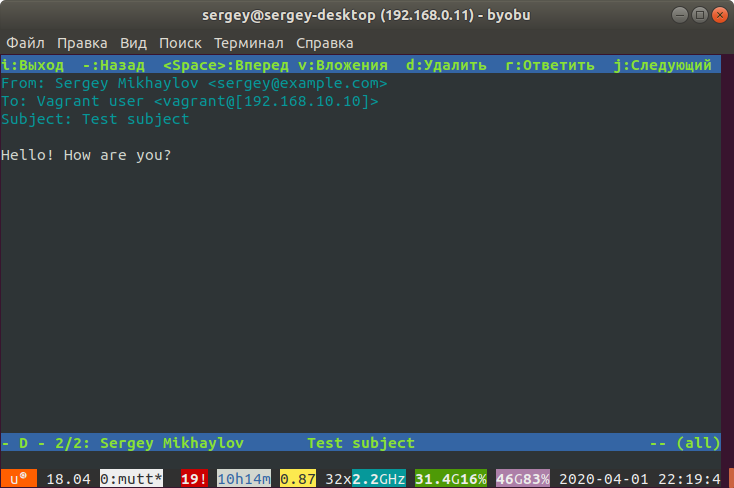

# **Установка почтового сервера**

установка минимального почтового сервера c `postfix` и `dovecot`
```
vagrant up
```
конфиги копируются на сервер с помощью роли `ansible` - roles/mail

--- 

## Проверка

отправка тестового почтового письма с хостовой машины

```
➜  mail git:(mail) ✗ telnet 192.168.10.10 25
Trying 192.168.10.10...
Connected to 192.168.10.10.
Escape character is '^]'.
220 server.localdomain ESMTP Postfix
HELO sergey@example.com
250 server.localdomain
mail from: <sergey@example.com>
250 2.1.0 Ok
rcpt to: <vagrant@[192.168.10.10]>
250 2.1.5 Ok
DATA
354 End data with <CR><LF>.<CR><LF>
From: Sergey Mikhaylov <sergey@example.com>
To: Vagrant user <vagrant@[192.168.10.10]>
Subject: Test subject
Content-Type: text/plain 

Hello! How are you?

.   
250 2.0.0 Ok: queued as ADA2E5A8A5
quit
221 2.0.0 Bye
Connection closed by foreign host.
➜  mail git:(mail) ✗
```

на хостовой машине добавлено в /etc/hosts
```
192.168.10.10 server
```

принятие тестового письма с помощью почтового клиента mutt на хостовой машине
```
mail git:(mail) ✗ mutt -f imap://vagrant@server
```


[сохраненное тестовое сообщение](test)