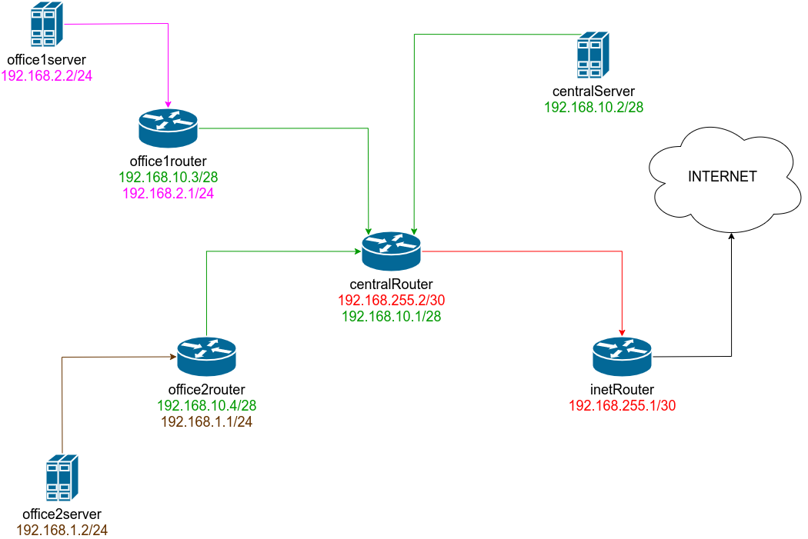

# Разворачиваем сетевую лабораторию

[Vagrantfile](Vagrantfile)

***Схема стенда***



---

# **Описание сетей**

## **Router-net**
|network  | router-net       |
|---------|------------------|
|Netmask  | 255.255.255.252  |
|Network  | 192.168.255.0/30 |
|Broadcast| 192.168.255.3    |
|HostMin  | 192.168.255.1    |
|HostMax  | 192.168.255.2    |
|Hosts/Net| 2                |

***Свободные подсети***
 
|network  | free1            | free2           | free3           | free4           | free5          | free6          |
|---------|------------------|-----------------|-----------------|-----------------|----------------|----------------|
|Network  |192.168.255.128/25|192.168.255.64/26|192.168.255.32/27|192.168.255.16/28|192.168.255.8/29|192.168.255.4/30|
|Netmask  |255.255.255.128   |255.255.255.192  |255.255.255.224  |255.255.255.240  |255.255.255.248 |255.255.255.252 |
|Broadcast|192.168.10.255    |192.168.10.127   |192.168.10.63    |192.168.10.31    |192.168.10.15   |192.168.10.7    |
|HostMin  |192.168.10.129    |192.168.10.65    |192.168.10.33    |192.168.10.17    |192.168.10.9    |192.168.10.5    |
|HostMax  |192.168.10.254    |192.168.10.126   |192.168.10.62    |192.168.10.30    |192.168.10.14   |192.168.10.6    |
|Hosts/Net|126               |62               |30               |14               |6               |2               | 


---

## **Central net**

|network  | dir-net         | hw-net          | mgt-net         |
|---------|-----------------|-----------------|-----------------|
|Network  | 192.168.10.0/28 | 192.168.10.32/28| 192.168.10.64/26|
|Netmask  | 255.255.255.240 | 255.255.255.240 | 255.255.255.192 |
|Broadcast| 192.168.10.15   | 192.168.10.47   | 192.168.10.127  |
|HostMin  | 192.168.10.1    | 192.168.10.33   | 192.168.10.65   |
|HostMax  | 192.168.10.14   | 192.168.10.46   | 192.168.10.126  |
|Hosts/Net| 14              | 14              | 62              |

***Свободные подсети***

|network  | free1            | free2           | free3            |
|---------|------------------|-----------------|------------------|
|Network  | 192.168.10.16/28 | 192.168.10.48/28| 192.168.10.128/25|
|Netmask  | 255.255.255.240  | 255.255.255.240 | 255.255.255.128  | 
|Broadcast| 192.168.10.31    | 192.168.10.63   | 192.168.10.255   |
|HostMin  | 192.168.10.17    | 192.168.10.49   | 192.168.10.129   |
|HostMax  | 192.168.10.30    | 192.168.10.62   | 192.168.10.254   |
|Hosts/Net| 14               | 14              | 126              |

---

## **Office1-net**

|network  | dev-net         | test-net        | mgt-net          | hw-net           |
|---------|-----------------|-----------------|------------------|------------------|
|Network  | 192.168.2.0/26  | 192.168.2.64/26 | 192.168.2.128/26 | 192.168.2.192/26 |
|Netmask  | 255.255.255.192 | 255.255.255.192 | 255.255.255.192  | 255.255.255.192  |
|Broadcast| 192.168.2.63    | 192.168.2.127   | 192.168.2.191    | 192.168.2.255    |
|HostMin  | 192.168.2.1     | 192.168.2.65    | 192.168.2.129    | 192.168.2.193    |
|HostMax  | 192.168.2.62    | 192.168.2.126   | 192.168.2.190    | 192.168.2.254    |
|Hosts/Net| 62              | 62              | 62               | 62

> Свободных подсетей нет.

---

## **Office2-net**

|network  | dev-net         | test-net         | hw-net           |
|---------|-----------------|------------------|------------------|
|Network  | 192.168.1.0/25  | 192.168.1.128/26 | 192.168.1.192/26 |
|Netmask  | 255.255.255.128 | 255.255.255.192  | 255.255.255.192  |
|Broadcast| 192.168.1.127   | 192.168.1.191    | 192.168.1.255    |
|HostMin  | 192.168.1.1     | 192.168.1.129    | 192.168.1.193    |
|HostMax  | 192.168.1.126   | 192.168.1.190    | 192.168.1.254    |
|Hosts/Net| 126             | 62               | 62               |

> Свободных подсетей нет.

---

# **Проверка**
```
[root@office1Server ~]# traceroute 192.168.1.2
traceroute to 192.168.1.2 (192.168.1.2), 30 hops max, 60 byte packets
 1  gateway (192.168.2.1)  0.911 ms  0.834 ms  0.783 ms
 2  192.168.10.1 (192.168.10.1)  2.480 ms  2.442 ms  2.397 ms
 3  192.168.10.4 (192.168.10.4)  2.354 ms  2.304 ms  2.261 ms
 4  192.168.1.2 (192.168.1.2)  2.219 ms  2.178 ms  2.491 ms

[root@office1Server ~]# traceroute 192.168.1.130
traceroute to 192.168.1.130 (192.168.1.130), 30 hops max, 60 byte packets
 1  gateway (192.168.2.1)  0.225 ms  0.141 ms  0.086 ms
 2  192.168.10.1 (192.168.10.1)  0.322 ms  0.449 ms  1.092 ms
 3  192.168.10.4 (192.168.10.4)  1.048 ms  1.002 ms  0.897 ms
 4  192.168.1.130 (192.168.1.130)  1.132 ms  1.083 ms *

[root@office1Server ~]# traceroute 192.168.1.194
traceroute to 192.168.1.194 (192.168.1.194), 30 hops max, 60 byte packets
 1  gateway (192.168.2.1)  0.232 ms  0.128 ms  0.083 ms
 2  192.168.10.1 (192.168.10.1)  0.303 ms  0.280 ms  1.661 ms
 3  192.168.10.4 (192.168.10.4)  2.289 ms  2.258 ms  2.223 ms
 4  192.168.1.194 (192.168.1.194)  2.165 ms  2.085 ms  2.047 ms

[root@office1Server ~]# traceroute ya.ru
traceroute to ya.ru (87.250.250.242), 30 hops max, 60 byte packets
 1  gateway (192.168.2.1)  2.505 ms  2.437 ms  2.396 ms
 2  192.168.10.1 (192.168.10.1)  2.322 ms  2.279 ms  2.241 ms
 3  192.168.255.1 (192.168.255.1)  2.569 ms  2.533 ms  2.494 ms
 4  * * *
 5  * * *
 6  * * *
 7  * * *
 8  ns-kem252br-te1-5-2900.ll-kem.zsttk.ru (81.1.200.233)  11.965 ms  5.185 ms  5.069 ms
 9  kmo01.transtelecom.net (217.150.44.118)  9.268 ms  9.217 ms  8.716 ms
10  mskn17ra-lo1.transtelecom.net (217.150.55.21)  53.037 ms  49.237 ms  47.304 ms
11  Yandex-gw.transtelecom.net (188.43.3.213)  45.240 ms  45.965 ms  50.694 ms
12  ya.ru (87.250.250.242)  50.632 ms  49.782 ms vla-32z2-eth-trunk1-1.yndx.net (93.158.172.51)  53.937 ms
```